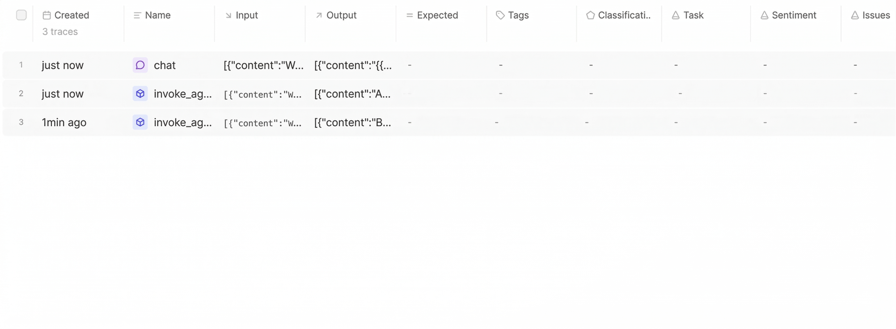
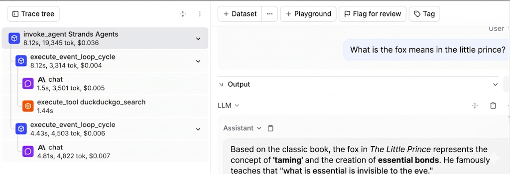
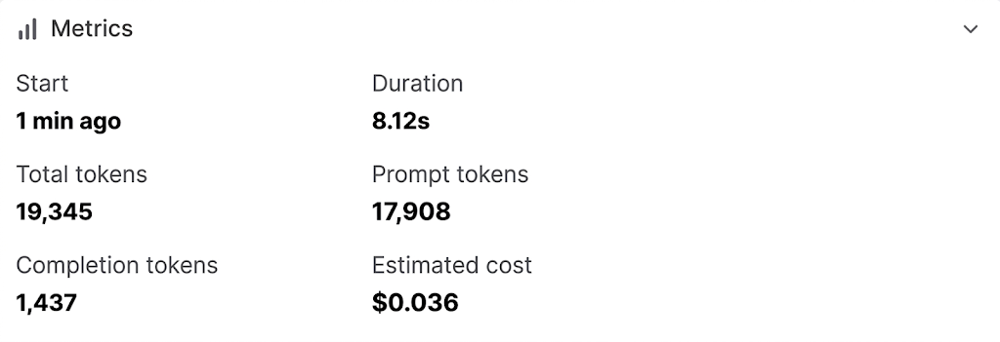

# Agent Observability Analysis

## Traces Overview

After each question is entered, a new trace is generated in Braintrust.

*Overview of multiple traces from Logs view*

## Trace Structure

The structure of each trace is similar. There is a root span, and the model used throughout is Claude 3 Haiku. Under the root span, there are two task spans. In the first task span, the agent invokes DuckDuckGo search as a tool span, and an LLM span processes the current input along with previous inputs carried as context. In the second task span, another LLM span synthesizes the search results to generate the final answer.

*Detailed view of a single trace showing spans*

## Metrics and Patterns

Each trace captures several metrics including start time, duration, offset time, total tokens, prompt tokens, completion tokens, and estimated cost. A clear pattern is that prompt tokens account for a much larger share of both token usage and cost compared to completion tokens. There is also a positive relationship between token count, duration, and cost: when token usage increases, the response generally takes longer and costs more. Questions that require more analysis and synthesis tend to use more tokens than questions with direct or definite answers.

*Metrics view showing token usage, latency, and other metrics*

## Observations on Tool Usage

When the agent invokes a tool, the trace includes an additional task span and another LLM span, which leads to higher overall token usage. However, tool usage also makes the final answer more accurate and better grounded in evidence. The Braintrust dashboard makes the entire problem-solving process of the agent much clearer and easier to follow. If the agent produces an incorrect or unexpected answer, the trace provides a clear audit trail to identify which step caused the issue, enabling more targeted adjustments to the agent.
